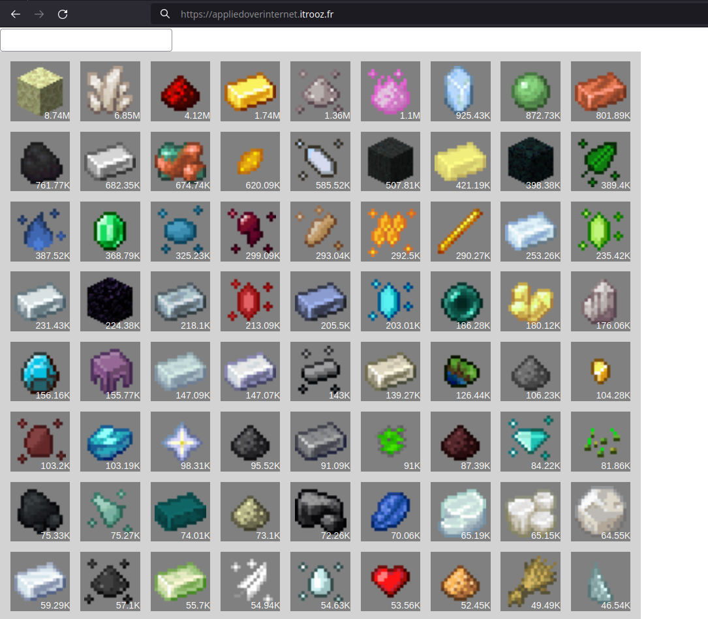
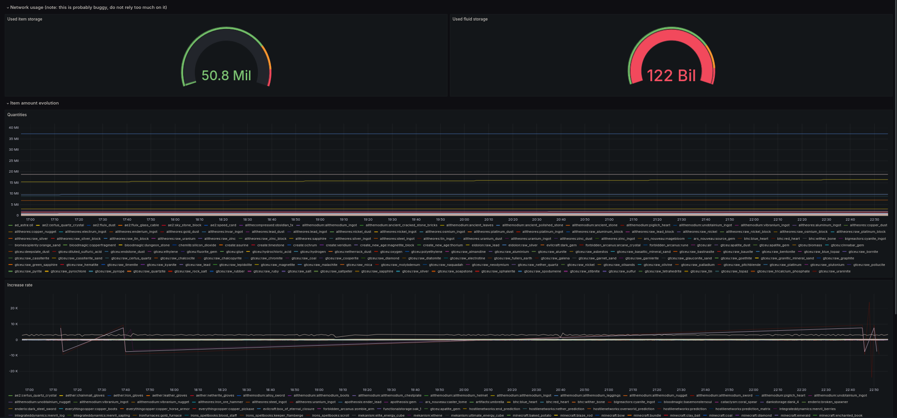
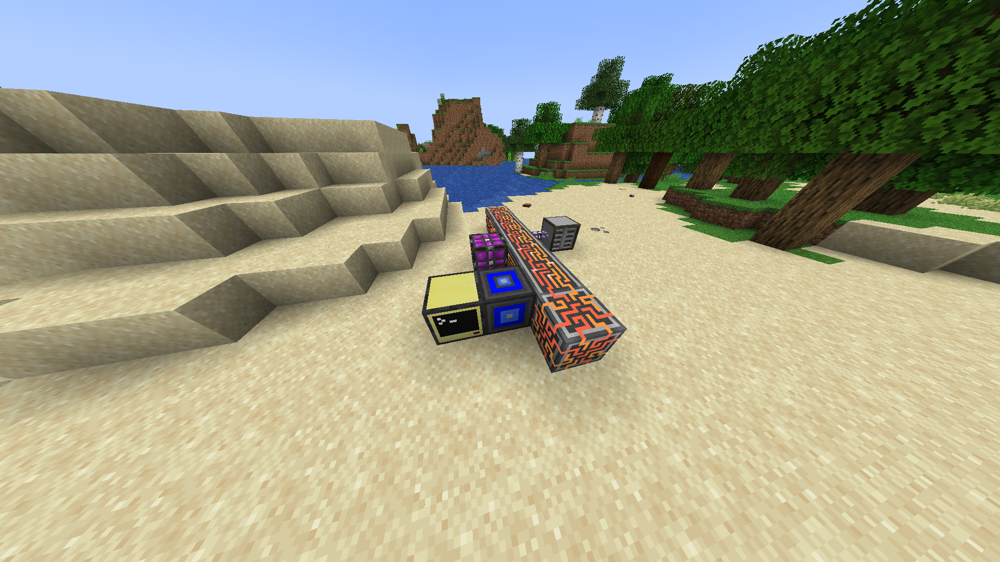

# Applied Over Internet

The goal of this project is to be able to see the contents of an Applied Energistics 2 (Minecraft mod) inventory through a website.

# Installation instructions

## Prerequisites
- Minecraft Server that you can access (you will need to modify configs)
- CC:Tweaked mod (ComputerCraft)
- Advanced Peripherical mod
- already usable AE2 setup
- Actual server to run the python webserver on (Preferably the server hosting the Minecraft server itself)
- Being able to mess around with stuff, because this tutorial isn't fool-proof

## Setup

### Retrieve the textures
- Install the mod https://github.com/CyclopsMC/IconExporter (https://www.curseforge.com/minecraft/mc-mods/iconexporter) and run the command `/iconexporter export` (in singleplayer, not on a physical server) to export the icons
- Find the output folder in your .minecraft directory, move it to the root of this cloned repository and rename it `input`
- Run the `reorder.py <path_to_your_minecraft_folder>` script, which will organise the textures in the `textures` folder.
- Move that `textures` folder to the server (hint: compress it for faster transfer)

### Setup the webserver
- Create the .env file (see .env.example template) ans modify the passwords
- Setup the python webserver
  - (Easiest + Stats support) Either run `docker compose --profile app up`
  - (Hardest + No stats support) Or run the `server.py` script (as a background program, with say `tmux` or `screen`) with `gunicorn -b 0.0.0.0:5000 server:app` (Don't use the flask default development server, for me it caused memory leaks due to creating a thread per request for some reason)
- (Optional) if you have an already existing nginx server (and/or want to go through to enable SSL), [here's a virtual host template](nginx_template.conf). And then do your stuff with Certbot

### Setup the Minecraft server
- Modify the server CC:Tweaked configuration file to enable the HTTP API and restart your server
  - the config can be found at `{world}/serverconfig/computercraft-server.toml`, set `enabled` to `true` in the `http` section
  - if you are going to run the python webserver on your local machine/network, you also need to remove the rule that disables access to private IPs later in the file. It is the one with `host = "$private"`. [Click here for more info](https://tweaked.cc/guide/local_ips.html#cc-1.87.0)

### In Minecraft

*screenshot from the modpack ATM9*

- Place your computer and your [ME bridge](https://advancedperipherals.madefor.cc/peripherals/me_bridge/) next to the AE2 network (the ME bridge must be connected to the AE2 network)
- Import [the following script](./send_request.lua) in the computer as the startup.lua script (either put it through `{world}/computercraft/computer/{id}` or upload it on pastebin)

# Requests graph
```mermaid
flowchart TD
    subgraph Server
        webserver[Python webserver]
        db[InfluxDB]
        subgraph Minecraft
            AE
            CC[CC:Tweaked script]
            CC -->|Requests data| AE
        end
        CC -->|Sends data| webserver
        webserver -->|Sends data| db

        grafana[Grafana]
        grafana -->|Requests data| db
    end
    user[User]
    user -->|Requests inventory HTML| webserver
    user -->|Requests stats HTML| grafana 
```
Legend: Arrows going from A to B (A->B) means that A **sends a request** to B. It sends nothing about which way the data transits, it could go from A to B or B to A

# Why ?
Because